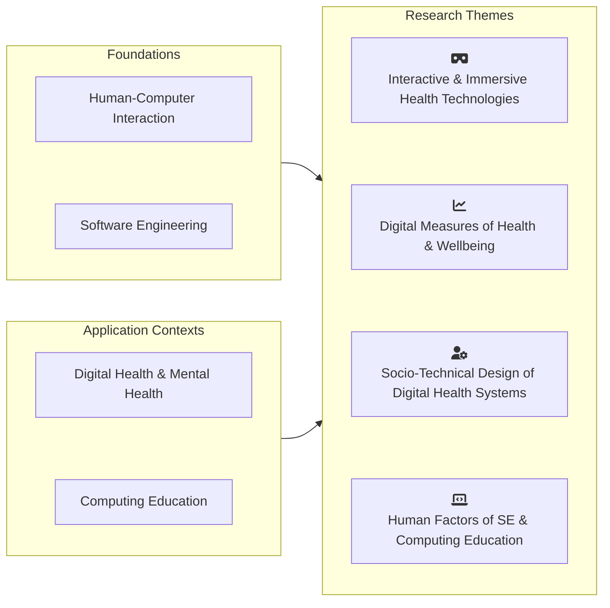

<!-- markdownlint-disable MD033 -->

I work in human-centred computing, with a particular focus on digital health. I study how interactive and intelligent systems behave in real-world settings and how they can be designed and evaluated to support patients, clinicians, and communities. My work spans platforms, immersive experiences, and socio-technical systems, always with an eye on practical impact.  

I also explore human factors in computing education and software engineering practice. This includes looking at how new tools and studio-inspired teaching approaches shape learning, collaboration, and professional development.

## Research Themes

### <i class="fas fa-vr-cardboard fa-fw headingIcon" aria-hidden="true"></i>Interactive & Immersive Health Technologies

This theme explores the design and deployment of health technologies that leverage immersive and interactive systems, including AR/VR/XR, conversational agents, and other novel interfaces. The focus is on creating engaging experiences that help people understand, manage, and act on their health. Work in this area examines how immersive systems can support learning, rehabilitation, and behaviour change, while maintaining accessibility and inclusion. Research combines participatory design with real-world evaluation to ensure solutions are usable, impactful, and seamlessly integrated into everyday clinical and community contexts.

### <i class="fas fa-chart-line fa-fw headingIcon" aria-hidden="true"></i>Digital Measures of Health & Wellbeing

Here, the emphasis is on developing systems that capture and interpret complex health data into actionable insights. This includes multimodal sensing, behavioural monitoring, and the creation of digital endpoints for both physical and mental health. The goal is to move beyond raw data, providing tools that help health professionals, patients, and communities make sense of information and take meaningful action. Central to this work is designing trustworthy, privacy- and ethics-aware architectures that are interoperable across devices, platforms, and care settings, while supporting long-term adoption and real-world use.

### <i class="fas fa-user-gear fa-fw headingIcon" aria-hidden="true"></i>Socio-Technical Design of Digital Health Systems

This theme takes a health informatics view of digital health systems, considering how technologies fit within existing care infrastructures and day-to-day clinical practice. It examines how tools shape, and are shaped by, workflows, organisational processes, and the movement of information between patients, professionals, and services. The focus is on interoperability, governance, and real-world data use, alongside participatory approaches that reflect the practical constraints of healthcare delivery, with the aim of supporting systems that are workable in practice as well as technically sound.

### <i class="fas fa-laptop-code fa-fw headingIcon" aria-hidden="true"></i>Human Factors of Software Engineering & Computing Education

This strand looks at the human side of software engineering and computing education, including how people learn, work together, and use development tools in practice. It explores studio-style approaches to teaching, as well as how emerging technologies such as generative AI are being introduced into learning environments and day-to-day development work. The aim is to better understand what supports effective learning and collaboration, while keeping questions of ethics, accountability, and real-world practice in view.
