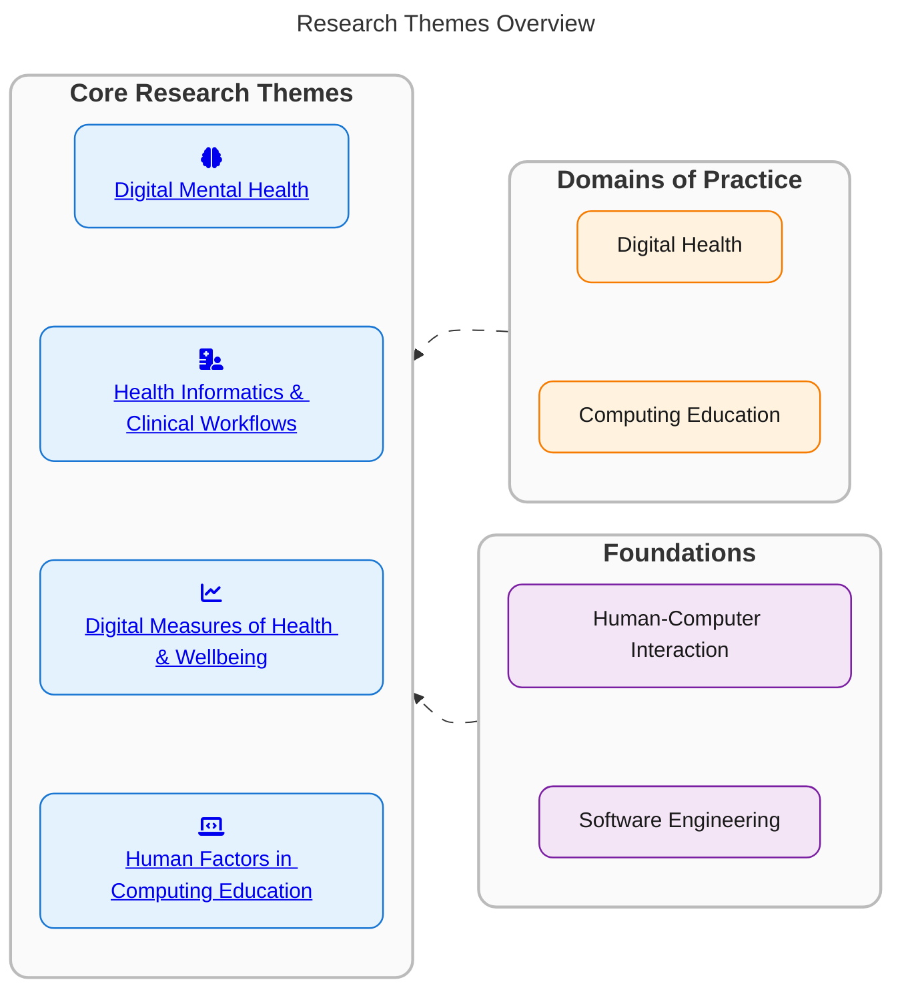

<!-- markdownlint-disable MD033 -->

I work in human-centred computing, with a particular focus on digital health. My research examines how interactive and intelligent systems behave in real-world settings and how they can be designed and evaluated to support patients, clinicians, and communities. My work spans platforms, immersive experiences, and socio-technical systems, always with an eye on practical impact.

I also explore human factors in computing education and software engineering practice. This includes looking at how new tools and studio-inspired teaching approaches shape learning, collaboration, and professional development.

```mermaid
---
title: Research Themes Overview
config:
    flowchart:
        curve: cardinal
        useMaxWidth: true
        htmlLabels: true
        nodeSpacing: 25
        rankSpacing: 50
---
flowchart RL
    accTitle: Research Themes and Domains of Practice Overview
    accDescr: This diagram shows the foundations, core research themes, and domains of practice of Christopher Bull's human-centred computing research. Foundational areas include Human-Computer Interaction and Software Engineering. All foundational topics inform the core research themes. Core themes include Digital Mental Health, Digital Measures of Health & Wellbeing, Health Informatics & Clinical Workflows, and Human Factors in Computing Education. Domains of practice are Digital Health and Computing Education.

    %% --- CORE RESEARCH THEMES ---
    subgraph T["Core Research Themes"]
        direction TB
        MH[<div class="mermaid-node-fixed-width"><a class="mermaid-theme-link" href="#digital-mental-health"><i class="fas fa-brain fa-fw" aria-hidden="true"></i><br>Digital Mental Health</a></div>] ~~~
        HI[<div class="mermaid-node-fixed-width"><a class="mermaid-theme-link" href="#health-informatics--clinical-workflows"><i class="fas fa-hospital-user fa-fw" aria-hidden="true"></i><br>Health Informatics & Clinical Workflows</a></div>] ~~~
        M[<div class="mermaid-node-fixed-width"><a class="mermaid-theme-link" href="#digital-measures-of-health--wellbeing"><i class="fas fa-chart-line fa-fw" aria-hidden="true"></i><br>Digital Measures of Health & Wellbeing</a></div>] ~~~
        E[<div class="mermaid-node-fixed-width"><a class="mermaid-theme-link" href="#human-factors-in-computing-education"><i class="fas fa-laptop-code fa-fw" aria-hidden="true"></i><br>Human Factors in Computing Education</a></div>]
    end

    %% --- DOMAINS OF PRACTICE (to the top-right) ---
    subgraph C["Domains of Practice"]
        direction TB
        DH[<div class="mermaid-node-fixed-width">Digital Health</div>] ~~~
        CE[<div class="mermaid-node-fixed-width">Computing Education</div>]
    end

    %% --- FOUNDATIONS (to the bottom-right) ---
    subgraph F["Foundations"]
        direction TB
        HCI[<div class="mermaid-node-fixed-width">Human-Computer Interaction</div>] ~~~
        SE[<div class="mermaid-node-fixed-width">Software Engineering</div>]
    end

    %% --- STRUCTURAL RELATIONSHIPS ---
    C e1@--> T
    F e2@--> T

    %% --- STYLING ---
    %% Core Research Themes: Soft blue with professional stroke
    classDef coreTheme fill:#e3f2fd,stroke:#1976d2,stroke-width:0.08em,color:#1a1a1a,font-size:1em,rx:0.65em,ry:0.65em;
    %% Domains of Practice: Soft amber/orange
    classDef domain fill:#fff3e0,stroke:#f57c00,stroke-width:0.08em,color:#1a1a1a,font-size:1em,rx:0.65em,ry:0.65em;
    %% Foundations: Soft purple
    classDef foundation fill:#f3e5f5,stroke:#7b1fa2,stroke-width:0.08em,color:#1a1a1a,font-size:1em,rx:0.65em,ry:0.65em;
    %% Subgraph styling: clean and light
    classDef subgraphStyle fill:#fafafa,stroke:#bbb,stroke-width:0.125em,font-size:1.1em,font-weight:bold,rx:0.75em,ry:0.75em;

    class MH,HI,M,E coreTheme;
    class DH,CE domain;
    class HCI,SE foundation;
    class T,C,F subgraphStyle;

    %% --- ARROW ANIMATION ---
    classDef animate stroke-dasharray: 9,5,stroke-dashoffset: 900,animation: dash 60s linear infinite;
    class e1,e2 animate;
```

## Research Themes

### <i class="fas fa-brain fa-fw headingIcon" aria-hidden="true"></i>Digital Mental Health



### <i class="fas fa-chart-line fa-fw headingIcon" aria-hidden="true"></i>Digital Measures of Health &amp; Wellbeing



### <i class="fas fa-hospital-user fa-fw headingIcon" aria-hidden="true"></i>Health Informatics &amp; Clinical Workflows



### <i class="fas fa-laptop-code fa-fw headingIcon" aria-hidden="true"></i>Human Factors in Computing Education



## Supporting Focus

Below is a selection of supporting interests that have shaped and extended my core research themes over time.

### <i class="fas fa-laptop-code fa-fw headingIcon" aria-hidden="true"></i>Human Factors of Software Engineering

This supporting focus explores human and organisational factors in software engineering practice, particularly in professional and industrial contexts. Research in this area examines requirements engineering, design practice, and decision-making processes, often investigating how engineers understand user needs, manage uncertainty, and respond to real-world constraints.

While much of this work has been grounded in digital health applications, the insights contribute to broader understanding of how software engineering methods and practices can be better designed to support cognition, collaboration, and professional judgement.

### <i class="fas fa-hands-helping fa-fw headingIcon" aria-hidden="true"></i>Community Health &amp; Civic Participation

This supporting focus reflects occasional and historical work on participatory approaches to digital health that engage citizens, communities, and public health stakeholders. Research in this area has included co-designing technologies and interventions with communities for health promotion, wellbeing, social inclusion, and civic engagement.

Work here explores how digital platforms can support community-based health initiatives, enable citizen participation in health decision-making, and address social determinants of health. Studies consider local contexts, community infrastructure, and participatory methods that ensure technologies are culturally appropriate, accessible, and workable for diverse populations.

### <i class="fas fa-universal-access fa-fw headingIcon" aria-hidden="true"></i>Accessibility &amp; Assistive Technologies

This supporting focus reflects collaborative work designing and evaluating technologies with disabled communities, with a focus on ensuring accessibility, inclusion, and independence. Research in this area has included co-designing mobile applications and communication systems for people who are Deaf or Hard of Hearing, and for people who stammer.

Work here emphasises participatory design approaches that centre the expertise and lived experience of disabled users, ensuring that technologies meet real communication and accessibility needs. Projects explore how digital tools can support self-management, social participation, and everyday interactions for people with disabilities.
