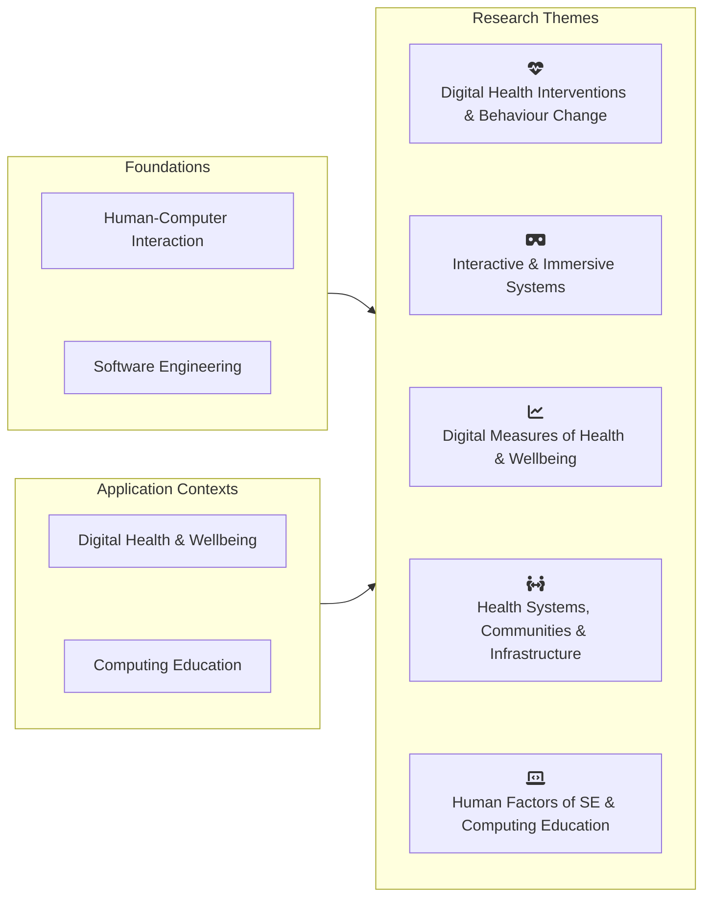

<!-- markdownlint-disable MD033 -->

I work in human-centred computing, with a particular focus on digital health. My research examines how interactive and intelligent systems behave in real-world settings and how they can be designed and evaluated to support patients, clinicians, and communities. My work spans platforms, immersive experiences, and socio-technical systems, always with an eye on practical impact.

I also explore human factors in computing education and software engineering practice. This includes looking at how new tools and studio-inspired teaching approaches shape learning, collaboration, and professional development.

```mermaid
flowchart LR
    accTitle: Research Themes and Application Contexts Overview
    accDescr: This diagram shows the foundations, research themes, and application contexts of Christopher Bull's human-centred computing research. Foundational areas include Human-Computer Interaction and Software Engineering. All foundational topics inform sll of the research themes. Research themes include Digital Health Interventions & Behaviour Change, Interactive & Immersive Systems, Digital Measures of Health & Wellbeing, Health Systems, Communities & Infrastructure, and Human Factors of Software Engineering & Computing Education. Application contexts are Digital Health & Wellbeing and Computing Education. Arrows indicate that foundations and contexts inform the research themes.

    subgraph F["Foundations"]
        direction TB
        HCI["Human-Computer Interaction"] ~~~ SE["Software Engineering"]
    end

    subgraph T["Research Themes"]
        direction TB
        D[<i class="fas fa-heart-pulse fa-fw" aria-hidden="true"></i><br>Digital Health Interventions & Behaviour Change] ~~~
        I[<i class="fas fa-vr-cardboard fa-fw" aria-hidden="true"></i><br>Interactive & Immersive Systems] ~~~
        M[<i class="fas fa-chart-line fa-fw" aria-hidden="true"></i><br>Digital Measures of Health & Wellbeing] ~~~
        S[<i class="fas fa-people-arrows fa-fw" aria-hidden="true"></i><br>Health Systems, Communities & Infrastructure] ~~~
        E[<i class="fas fa-laptop-code fa-fw" aria-hidden="true"></i><br>Human Factors of SE & Computing Education]
    end

    subgraph C["Application Contexts"]
        direction TB
        DH["Digital Health & Wellbeing"] ~~~
        CE["Computing Education"]
    end

    F --> T
    C --> T
```

## Research Themes

### <i class="fas fa-heart-pulse fa-fw headingIcon" aria-hidden="true"></i>Digital Health Interventions &amp; Behaviour Change

This theme focuses on the design and evaluation of digital technologies that actively support changes in health behaviour, wellbeing, or care practice. Work in this area includes conversational agents, decision support tools, and interactive applications that help individuals or professionals understand and act on health-related information.

Research explores how interventions are experienced in everyday life and how digital systems can support self-management, reflection, learning, and therapeutic engagement over time.

### <i class="fas fa-vr-cardboard fa-fw headingIcon" aria-hidden="true"></i>Interactive &amp; Immersive Systems

This theme examines how emerging interfaces, including AR, VR, XR, and intelligent interactive systems, can support health and wellbeing. The focus is on designing engaging and accessible experiences that enable learning, rehabilitation, communication, or reflection.

Work in this area considers how immersive technologies can be integrated into clinical and community contexts in ways that are usable, acceptable, and sustainable in practice.

### <i class="fas fa-chart-line fa-fw headingIcon" aria-hidden="true"></i>Digital Measures of Health &amp; Wellbeing

Research in this theme explores how complex health-related behaviours and experiences can be captured and interpreted using digital technologies. This includes multimodal sensing, behavioural monitoring, and the development of digital endpoints for both physical and mental health.

The goal is to translate data into meaningful insights that support decision-making by patients, clinicians, and communities, while maintaining trust, transparency, and ethical data use.

### <i class="fas fa-people-arrows fa-fw headingIcon" aria-hidden="true"></i>Health Systems, Communities &amp; Infrastructure

This theme considers how digital health technologies are shaped by&mdash;and must adapt to&mdash;the organisational, social, and community contexts in which they are used. Research examines how systems are integrated into clinical workflows, educational settings, or community initiatives, and how infrastructure, governance, and local practice influence adoption and long-term use.

Participatory and co-design approaches are central to this work, supporting technologies that are workable in practice as well as technically sound.

### <i class="fas fa-laptop-code fa-fw headingIcon" aria-hidden="true"></i>Human Factors of Software Engineering &amp; Computing Education

This strand focuses on the human side of software engineering practice and computing education. It explores how people learn, collaborate, and engage with development tools, including the integration of emerging technologies such as generative AI into teaching and professional workflows.

The aim is to better understand what supports effective learning and responsible development practice in real-world settings.
