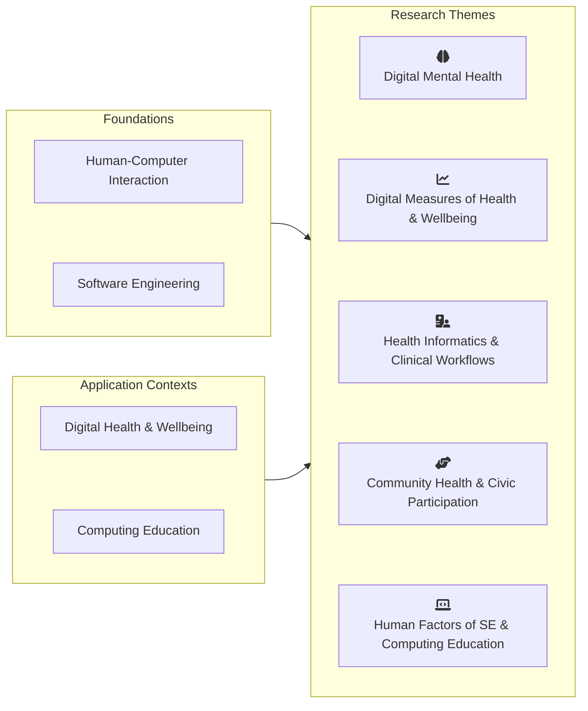

<!-- markdownlint-disable MD033 -->

I work in human-centred computing, with a particular focus on digital health. My research examines how interactive and intelligent systems behave in real-world settings and how they can be designed and evaluated to support patients, clinicians, and communities. My work spans platforms, immersive experiences, and socio-technical systems, always with an eye on practical impact.

I also explore human factors in computing education and software engineering practice. This includes looking at how new tools and studio-inspired teaching approaches shape learning, collaboration, and professional development.

```mermaid
flowchart LR
    accTitle: Research Themes and Application Contexts Overview
    accDescr: This diagram shows the foundations, research themes, and application contexts of Christopher Bull's human-centred computing research. Foundational areas include Human-Computer Interaction and Software Engineering. All foundational topics inform all of the research themes. Research themes include Digital Mental Health, Digital Measures of Health & Wellbeing, Health Informatics & Clinical Workflows, Community Health & Civic Participation, and Human Factors of Software Engineering & Computing Education. Application contexts are Digital Health & Wellbeing and Computing Education. Arrows indicate that foundations and contexts inform the research themes.

    subgraph F["Foundations"]
        direction TB
        HCI["Human-Computer Interaction"] ~~~ SE["Software Engineering"]
    end

    subgraph T["Research Themes"]
        direction TB
        MH[<i class="fas fa-brain fa-fw" aria-hidden="true"></i><br>Digital Mental Health] ~~~
        M[<i class="fas fa-chart-line fa-fw" aria-hidden="true"></i><br>Digital Measures of Health & Wellbeing] ~~~
        HI[<i class="fas fa-hospital-user fa-fw" aria-hidden="true"></i><br>Health Informatics & Clinical Workflows] ~~~
        CH[<i class="fas fa-hands-helping fa-fw" aria-hidden="true"></i><br>Community Health & Civic Participation] ~~~
        E[<i class="fas fa-laptop-code fa-fw" aria-hidden="true"></i><br>Human Factors of SE & Computing Education]
    end

    subgraph C["Application Contexts"]
        direction TB
        DH["Digital Health & Wellbeing"] ~~~
        CE["Computing Education"]
    end

    F --> T
    C --> T
```

## Research Themes

### <i class="fas fa-brain fa-fw headingIcon" aria-hidden="true"></i>Digital Mental Health

This theme explicitly focuses on the design, evaluation, and deployment of digital technologies for mental health and wellbeing. Work in this area includes conversational agents for dementia care, passive monitoring systems for depression and anxiety, therapeutic interventions using immersive technologies, and digital tools supporting maternal mental health.

Research examines how digital systems can provide monitoring, intervention, and support for mental health conditions across the lifespan, with attention to the distinct ethical, privacy, and engagement challenges inherent in mental health contexts. This includes understanding how people with lived experience, carers, and clinicians interact with mental health technologies in everyday and clinical settings.

### <i class="fas fa-chart-line fa-fw headingIcon" aria-hidden="true"></i>Digital Measures of Health &amp; Wellbeing

Research in this theme explores how complex health-related behaviours and experiences can be captured and interpreted using digital technologies. This includes multimodal sensing, behavioural monitoring, and the development of digital endpoints for both physical and mental health.

The goal is to translate data into meaningful insights that support decision-making by patients, clinicians, and communities, while maintaining trust, transparency, and ethical data use.

### <i class="fas fa-hospital-user fa-fw headingIcon" aria-hidden="true"></i>Health Informatics &amp; Clinical Workflows

This theme focuses on the design, implementation, and evaluation of digital health systems within clinical practice and healthcare organisations. Research examines health informatics systems including electronic health records, clinical decision support tools, care coordination platforms, and imaging workflows.

Work explores the socio-technical challenges of integrating digital technologies into clinical settings, focusing on how healthcare professionals experience and adapt to these systems. Studies address organisational change, professional practice, infrastructure requirements, and governance considerations that shape sustainable adoption in real-world healthcare contexts.

### <i class="fas fa-hands-helping fa-fw headingIcon" aria-hidden="true"></i>Community Health &amp; Civic Participation

This theme examines participatory approaches to digital health that engage citizens, communities, and public health stakeholders. Research focuses on co-designing technologies and interventions with communities for health promotion, wellbeing, social inclusion, and civic engagement.

Work in this area explores how digital platforms can support community-based health initiatives, enable citizen participation in health decision-making, and address social determinants of health. Studies consider local contexts, community infrastructure, and participatory methods that ensure technologies are culturally appropriate, accessible, and workable for diverse populations.

### <i class="fas fa-laptop-code fa-fw headingIcon" aria-hidden="true"></i>Human Factors of Software Engineering &amp; Computing Education

This strand focuses on the human side of software engineering practice and computing education. It explores how people learn, collaborate, and engage with development tools, including the integration of emerging technologies such as generative AI into teaching and professional workflows.

The aim is to better understand what supports effective learning and responsible development practice in real-world settings.
