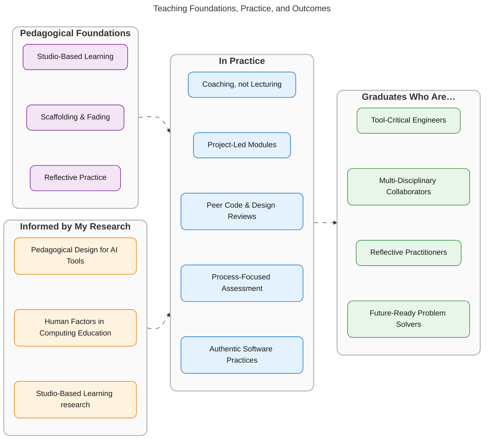

<!-- markdownlint-disable MD033 -->

I teach computing as a hands-on, studio-based practice, and I research how generative AI is reshaping the way students learn to build software. My teaching and my research feed each other: insights from working with student teams flow into published findings, and those findings shape how I run my modules.

## Teaching Values

  

    <i class="fas fa-drafting-compass fa-1.5x" aria-hidden="true"></i>
    <strong>Studio-Based Learning</strong> 
    Architecture-studio-inspired teaching: coaching, peer learning, reflective practice, and project-led work in multi-disciplinary teams.
  

  

    <i class="fas fa-layer-group fa-1.5x" aria-hidden="true"></i>
    <strong>Scaffolding &amp; Fading</strong> 
    Providing scaffolded support and progressively reducing it as students grow in independence.
  

  

    <i class="fas fa-compass fa-1.5x" aria-hidden="true"></i>
    <strong>Critical, Adaptive Practice</strong> 
    Graduates who can critically evaluate the tools reshaping their profession, not just use them.
  

> "Knowing what questions to ask (or how to iterate on a question) is a skill." 
> <small>&mdash; <a href="https://doi.org/10.1109/MS.2023.3300574">Bull &amp; Kharrufa, <em>IEEE Software</em> (2024)</a></small>
{: .notice--info}

## Two Pillars of My Teaching

I teach software engineering as a project-based practice, integrating Human-Computer Interaction to ground students' thinking about users and systems. Two pedagogical commitments shape how I approach it:

### <i class="fas fa-drafting-compass fa-fw headingIcon" aria-hidden="true"></i>Studio-Based Learning

I am committed to **Studio-Based Learning (SBL)** — a hands-on, project- and problem-based teaching method inspired by architecture, design, and art studios. Studio teaching centres on coaching rather than lecturing, peer learning, reflective practice, and multi-disciplinary teamwork. It is particularly well-suited to software engineering, where collaboration, judgement, and adapting to real-world constraints matter at least as much as technical knowledge.

I [researched and helped to successfully implement](http://www.research.lancs.ac.uk/portal/en/publications/studios-in-software-engineering-education(a6a4d34e-cb6e-4eba-b558-03a8a10d2831).html) the studio approach throughout Software Engineering at Lancaster University, and I continue to engage with it both as an educator and a researcher. My work in this area was recognised with a **Best Paper award at [CSEE&amp;T 2014](https://conferences.computer.org/cseet/)**.

<a href="/research/studio-education/" class="btn btn--primary">Studio-Based Learning research <i class="fas fa-arrow-right" aria-hidden="true"></i></a>

### <i class="fas fa-robot fa-fw headingIcon" aria-hidden="true"></i>Teaching with Generative AI in Computing Education

Generative AI is changing what it means to learn to program. In an [IEEE Software article](https://doi.org/10.1109/MS.2023.3300574) with [Ahmed Kharrufa](https://openlab.ncl.ac.uk/people/ahmed-kharrufa/), I argued that the right pedagogical response is **integration with critical judgement**, not avoidance. Treating GenAI as a forbidden tool misses the chance to teach the harder, more durable skill: *how* and *when* to use these tools well.

In a [follow-up study](https://doi.org/10.1145/3779296) with my colleagues, we found that GenAI in a 2nd-year software engineering team project plays three distinct **roles** for students: as an *educator* (explanations, worked examples, mentor), as a *peer* (brainstorming, reviewing code and documents, bridging the skills gap within teams), and as an *assistant* (boilerplate, tests, bug fixing). We proposed a **design space** (roles &times; support-ability patterns &times; transparency) to help educators and tool-builders maximise the learning benefits while mitigating the risks. These ideas directly shape how I run my software engineering team-project modules.

<a href="/research/gen-ai-comp-education/" class="btn btn--primary">Generative AI in Computing Education research <i class="fas fa-arrow-right" aria-hidden="true"></i></a>

## How My Teaching and Research Connect

<i class="fas fa-award fa-fw" aria-hidden="true"></i> Active in the wider computing education research community as a regular program committee member and peer reviewer, recognised with a **Distinguished Reviewer Award at CSEE&amp;T 2020**.
{: .notice}

## Equality, Equity &amp; Diversity

I take equality, equity, and diversity seriously in my teaching and supervision. I set out my position and the actions I am taking [on a dedicated page](/equality.html), and I am happy to be [contacted](/profile/#contacting-me) about it.
{: .notice}

## Explore Further

  <a href="/research/themes/#human-factors-in-computing-education" class="btn btn--primary"><i class="fas fa-laptop-code fa-fw headingIcon" aria-hidden="true"></i>Computing Education Research</a>
  <a href="/research/gen-ai-comp-education/" class="btn btn--primary"><i class="fas fa-robot fa-fw headingIcon" aria-hidden="true"></i>Generative AI Project</a>
  <a href="/teaching/courses/" class="btn btn--primary"><i class="fas fa-chalkboard fa-fw headingIcon" aria-hidden="true"></i>Modules & Approaches</a>

